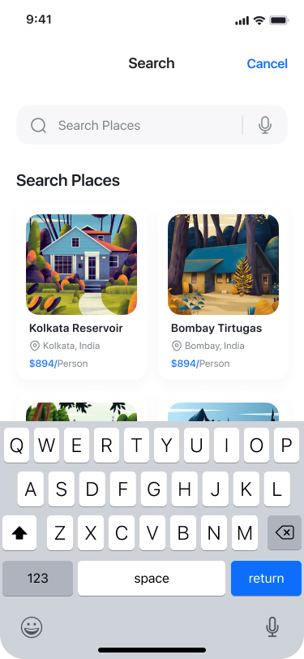
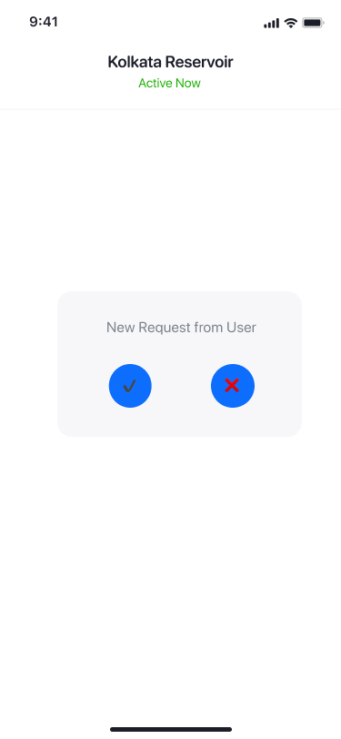
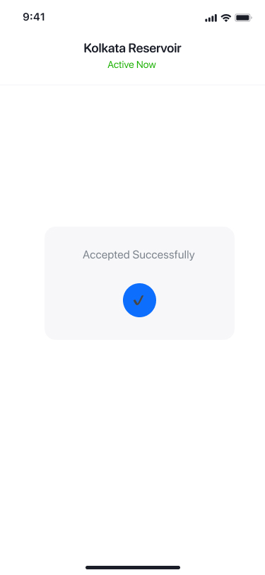

# Owner App – Booking Agent

Owner App for booking request management.  
The app allows the owner to activate destinations and manage booking requests in real time.

---

## Features
- **Search And Browse Destinations**
  - Owner can search for destinations
  
- **Activate Destinations**
  - If the owner selects a destination it will be opened and marked as **Active**.
- **Receive Booking Requests**
  - Booking requests appear instantly when users book an active destination.
  
- **Accept / Reject Requests**
  - Owner can accept or reject booking requests.
  
- **Instant Sync**
  - Booking decisions update instantly on the Customer App.
- **Background Handling**
  - Requests are received even when the app is in the background (Firestore real-time listeners).

---

## 🔄 Real-time Sync

- Firebase Firestore real-time listeners are used.
- New booking requests appear immediately without manual refresh.
- Status updates propagate instantly to the Customer App.

---

## Tech Stack

- **Language:** Kotlin
- **UI:** Jetpack Compose
- **Architecture:** MVVM
- **State Management:** StateFlow
- **Backend:** Firebase Firestore
- **Async:** Kotlin Coroutines & Flow

---

## Customar App

- **Customer App Repository:**  
  https://github.com/001iftikar/Customer-Intern.git
